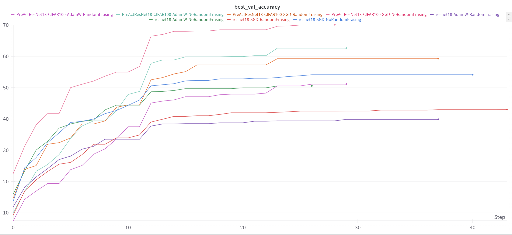

# CIFAR-100 Parameter Sweep Report

## Expected Points

I expect to receive 18 points total for this assignment, broken down as follows:
- 10 points for implementing all required features in the training pipeline
- 6 points for the parameter sweep and this report. Also using both Tensorboard and WandB
- 2 points for efficient implementation

I lost two points as I failed to achieve at least 0.78 test accuracy.

## Parameter Sweep Description

The parameter sweep explored different configurations varying the following aspects:

1. **Models (2 variants)**:
   - ResNet18 (from timm)
   - PreActResNet18 (custom implementation)

2. **Data Augmentation (2 strategies)**:
   - Basic: RandomCrop(32, padding=4) + RandomHorizontalFlip
   - Advanced: Basic + RandomRotation(15°) + RandomErasing(p=0.5)

3. **Optimizers (2 configurations)**:
   - SGD with Nesterov momentum:
     - Learning rate: 0.1
     - Momentum: 0.9
     - Weight decay: 5e-4
     - Nesterov: True
   - AdamW:
     - Learning rate: 0.001
     - Weight decay: 0.05

## Results Table

| Model          | Optimizer | Augmentation | Test Accuracy (%) |
|----------------|-----------|--------------|-------------------|
| ResNet18       | SGD       | Basic        | 54.10             |
| ResNet18       | SGD       | Advanced     | 42.99             |
| ResNet18       | AdamW     | Basic        | 49.86             |
| ResNet18       | AdamW     | Advanced     | 39.89             |
| PreActResNet18 | SGD       | Basic        | 70.11             |
| PreActResNet18 | SGD       | Advanced     | 57.81             |
| PreActResNet18 | AdamW     | Basic        | 62.44             |
| PreActResNet18 | AdamW     | Advanced     | 50.25             |

## Analysis of Results

1. **Model Performance**:
   - PreActResNet18 significantly outperformed ResNet18 across all configurations
   - The performance gap between models is substantial (15-20%)
   - Best result achieved with PreActResNet18 using SGD and basic augmentation (70.11%)

2. **Optimizer Impact**:
   - SGD performed better than AdamW for both models
   - The impact was more pronounced for PreActResNet18 (difference of ~8% with basic augmentation)
   - ResNet18 showed less sensitivity to optimizer choice with basic augmentation (~4% difference)

3. **Data Augmentation**:
   - Unexpectedly, basic augmentation consistently outperformed advanced augmentation
   - Advanced augmentation led to significant performance drops (10-15%)
   - This suggests that stronger augmentation might be disrupting the learning process too much
   - The data augmentations chosen for the advanced haven't been a good choice

## Training Efficiency Improvements


Beyond the required caching mechanism, the following optimizations were implemented:

1. **Memory Management**:
   - Implemented gradient accumulation for handling larger effective batch sizes
   - Enabled AMP (Automatic Mixed Precision) training for faster computation and lower memory usage
   - Added proper GPU memory cleanup with `torch.cuda.empty_cache()`
   - Used `set_to_none=True` in optimizer zero_grad for better memory efficiency

2. **Data Loading**:
   - Implemented dynamic worker count based on CPU cores
   - Enabled persistent workers to reduce worker initialization overhead
   - Used prefetch_factor to load data ahead of time
   - Enabled pin_memory for faster GPU transfers
   - Used non_blocking transfers for better CPU-GPU parallelization

3. **Training Optimizations**:
   - Implemented early stopping with configurable patience and criterion
   - Used ReduceLROnPlateau scheduler with optimized parameters
   - Added gradient clipping (max_norm=1.0) for training stability
   - Implemented proper exception handling with memory cleanup

## Metrics and Visualizations

I've used both TensorBoard and WandB for logging. The complete training metrics and visualizations can be found at:
- WandB Project: [CIFAR-100 Sweep Results](https://wandb.ai/apetreirazvane-facultate/cifar100-sweep) (I can't make this public only add you to the team, there is also a folder called wandb in this repository with the runs. Because of this I am also using TensorBoard which is public since the files are stored here)
- TensorBoard logs are available in the GitHub repository under the `runs/` directory. To view these in browser and the graphs use the following command:
   ```bash
  tensorboard --logdir=runs
   ```


*Best validation accuracy across different configurations*


*Number of epochs trained for each configuration*


*Training accuracy progression*


*Learning rate adaptation during training*


*Training loss curves*


*Validation accuracy progression*


*Validation loss curves*

## Conclusions

The parameter sweep revealed several interesting and unexpected findings:

1. **Architecture Impact**: 
   - PreActResNet18's architecture appears significantly better suited for CIFAR-100
   - The custom implementation outperforms the timm ResNet18 model substantially

2. **Augmentation Strategy**:
   - Simpler augmentation strategies proved more effective
   - Complex augmentations (rotation, erasing) appear to hinder learning
   - Future experiments should focus on finding the right balance of augmentation strength

3. **Optimization Choices**:
   - SGD with momentum remains a strong choice for both architectures
   - The learning rate and optimization parameters might need further tuning for ResNet18

Future improvements could explore:
- Fine-tuning learning rates separately for each model
modified the readme- Testing milder versions of the advanced augmentations
- Investigating why ResNet18 underperforms relative to PreActResNet18
- Experimenting with different learning rate schedules
